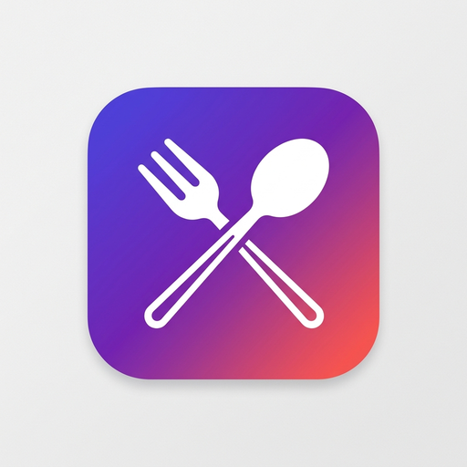

<div align="center">
  
  <h1>🍛 VIT-AP Eats</h1>
  <p><b>A blazing-fast, edge-rendered food delivery platform for the VIT-AP University campus.</b></p>
  
  [](https://nextjs.org/)
  [](https://workers.cloudflare.com/)
  [](https://supabase.com/)
  [](https://tailwindcss.com/)
</div>

<br/>

## ✨ Features
- 🚀 **Progressive Web App (PWA)**: Installable on iOS & Android with offline-first capabilities.
- ⚡ **Edge Architecture**: Hono APIs deployed on Cloudflare Workers for ~0ms cold starts.
- 🗺️ **Live Delivery Tracking**: Real-time driver location via Leaflet & OpenStreetMap, powered by Supabase WebSockets.
- 💳 **Seamless Payments**: Razorpay integration with automated webhooks and status syncing.
- 🔐 **Role-Based Security**: Customer, Restaurant Partner, and Admin roles secured via JWT and Cloudflare KV Rate Limiting.

---

## 🏗️ Architecture

VIT-AP Eats utilizes a modern, decoupled architecture designed for high scalability and minimal latency:

1. **Frontend (Next.js 16)**
   - Deployed on **Cloudflare Pages**.
   - Handles SSR/SSG and Client-side rendering.
   - Communicates with Supabase directly for Auth.
   - Communicates with the backend worker for secure operations (payments, complex joins, rate limiting).
   - State managed via Zustand & React Query.

2. **Backend API (Hono)**
   - Deployed on **Cloudflare Workers** (V8 Isolates).
   - Interacts with Supabase using the raw REST API to bypass heavy SDK sizes on the edge.
   - Guards sensitive routes with JWT validation middleware and sliding-window rate limiters.

3. **Database & Realtime (Supabase)**
   - **PostgreSQL + PostGIS**: Handles spatial queries (e.g. finding restaurants near a student block).
   - **Realtime / WebSockets**: Streams order status changes from the kitchen directly to the user's phone.

---

## 🛠️ Local Development Setup

### Prerequisites
- [Node.js v20+](https://nodejs.org/)
- [Supabase CLI](https://supabase.com/docs/guides/cli) (optional, for local DB)
- [Wrangler CLI](https://developers.cloudflare.com/workers/wrangler/install-and-update/) (`npm install -g wrangler`)

### 1. Environment Variables
Create a single `.env` file in the root of the project.
```env
# Supabase
NEXT_PUBLIC_SUPABASE_URL="your-project.supabase.co"
NEXT_PUBLIC_SUPABASE_ANON_KEY="your-anon-key"
SUPABASE_SERVICE_ROLE_KEY="your-service-key"

# Cloudflare / API
NEXT_PUBLIC_API_URL="http://localhost:8787"

# Razorpay
NEXT_PUBLIC_RAZORPAY_KEY_ID="rzp_test_..."
RAZORPAY_KEY_SECRET="your_secret..."
```

### 2. Start the Backend (Hono)
```bash
cd backend
npm install
npm run dev
```
The API will start at `http://localhost:8787`.

### 3. Start the Frontend (Next.js)
```bash
cd vitap-eats
npm install
npm run dev
```
The web app will start at `http://localhost:3000`.

---

## 🚀 CI/CD & Deployment

This project uses **GitHub Actions** for continuous integration and continuous deployment (`.github/workflows/deploy.yml`).

On every push to `main`:
1. Code is linted and security audited (`npm audit --audit-level=critical`).
2. The Hono backend is compiled and deployed to Cloudflare Workers.
3. The Next.js frontend is built and deployed to Cloudflare Pages.

To enable this, set the following secrets in your GitHub repository:
- `CLOUDFLARE_API_TOKEN`
- `CLOUDFLARE_ACCOUNT_ID`
- `SUPABASE_URL`
- `SUPABASE_ANON_KEY`
- `RAZORPAY_KEY_ID`

---
<div align="center">
  <i>Built for the students, by the students. 🚀</i>
</div>
